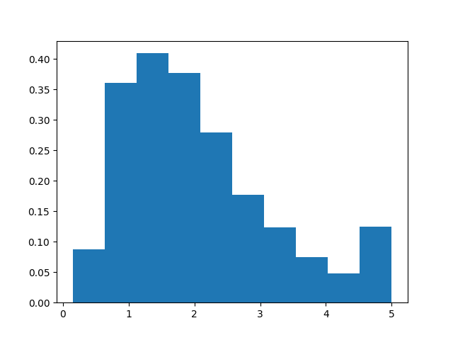

########################
Bias-Variance User Guide
########################

**********
Motivation
**********

Statistical Bias vs. "Fairness"
===============================

For this user guide and associated submodule, we are referring to
`statistical bias <https://en.wikipedia.org/wiki/Bias_(statistics)>`_ rather
than the "fairness" type of bias.

Why should we care about bias and variance?
===========================================

Bias and variance are two indicators of model performance and together represent
two-thirds of model error (the remaining one-third is irreducible "noise" error that
comes from the data set itself). We can define bias and variance as follows
by training a model with multiple `bootstrap sampled
<https://en.wikipedia.org/wiki/Bootstrapping_(statistics)>`_ training sets, resulting in
multiple instances of the model.

.. topic:: Bias and variance defined over multiple training sets:

    * Bias represents the average difference between the prediction a model makes and the correct prediction.
    * Variance represents the average variability of the prediction a model makes.

Typically, a model with high bias is "underfit" and a model with high variance is
"overfit," but keep in mind this is not always the case and there can be many reasons
why a model has high bias or high variance. An "underfit" model is oversimplified and
performs poorly on the training data, whereas an "overfit" model sticks too closely to
the training data and performs poorly on unseen examples. See Scikit-Learn's
`Underfitting vs. Overfitting
<https://scikit-learn.org/stable/auto_examples/model_selection/plot_underfitting_overfitting.html>`_
for a clear example of an "underfit" model vs. an "overfit" model.

There is a concept
known as the `"bias-variance tradeoff"
<https://en.wikipedia.org/wiki/Bias%E2%80%93variance_tradeoff>`_ that describes
the relationship between high bias and high variance in a model. Our ultimate goal
here is to find the ideal balance where both bias and variance is at a minimum.
It is also important from a business problem standpoint on whether the model
error that we are unable to reduce should favor bias or variance.

*****************************************
Visualize Bias and Variance With Examples
*****************************************

In order to easily understand the concepts of bias and variance, we will show
four different examples of models for each of the high and low bias and variance
combinations. These are extreme and engineered cases for the purpose of clearly
seeing the bias/variance.

Before we begin, let's take a look at the distribution of the labels. Notice
that the majority of label values are around 1 and 2, and much less around 5.

First we have a model with high bias and low variance. We artificially
introduce bias to the model by adding 10 to every training label, but leaving
the test labels as is. Given that values of greater than 5 in the entire label
set are considered outliers, we are fitting the model against outliers.

    Five sets of mean squared error results from the test set from the five
    bootstrap sample trainings of the model. Notice the model error is very
    consistent among the trials and is not centered around 0.

Next we have a model with low bias and high variance. We simulate this by
introducing 8 random "noise" features to the data set. We also reduce the size
of the training set and train a neural network over a low number of epochs.

    Five sets of mean squared error results from the test set from the five
    bootstrap sample trainings of the model. Notice the model error has
    different distributions among the trials and centers mainly around 0.

Next we have a model with high bias and high variance. We simulate through
a combination of the techniques from the high bias low variance example and
the low bias high variance example and train another neural network.

    Five sets of mean squared error results from the test set from the five
    bootstrap sample trainings of the model. Notice the model error has
    different distributions among the trials and is not centered around 0.

Finally we have a model with low bias and low variance. This is a simple
linear regression model with no modifications to the training or test labels.

.. figure:: images/low_bias_low_variance.png
    :width: 800px
    :align: center
    :height: 400px
    :alt: alternate text
    :figclass: align-center

    Five sets of mean squared error results from the test set from the five
    bootstrap sample trainings of the model. Notice the model error is very
    consistent among the trials and centers mainly around 0.

***************************
Bias-Variance Decomposition
***************************

.. currentmodule:: mvtk.bias_variance

There are formulas for breaking down total model error into three parts: bias,
variance, and noise. This can be applied to both regression problem loss
functions (mean squared error) and classification problem loss functions
(0-1 loss). In a paper by Pedro Domingos, a method of unified
decomposition was proposed for both types of problems:cite:`domingos2000decomp`.

First lets define :math:`y` as a single prediction, :math:`D` as the set of
training sets used to train the models, :math:`Y` as the set of predictions
from the models trained on :math:`D`, and a loss function :math:`L` that
calculates the error between our prediction :math:`y` and the correct
prediction.
The main prediction :math:`y_m` is the smallest average loss for a prediction
when compared to the set of predictions :math:`Y`. The main prediction is
the mean of :math:`Y` for mean squared error and the mode of :math:`Y` for
0-1 loss:cite:`domingos2000decomp`.

Bias can now be defined for a single example :math:`x` over the set of models
trained on :math:`D` as the loss calculated between the main prediction
:math:`y_m` and the correct prediction :math:`y_*`:cite:`domingos2000decomp`.

.. math::
    B(x) = L(y_*,y_m)

Variance can now be defined for a single example :math:`x` over the set of
models trained on :math:`D` as the average loss calculated between all predictions
and the main prediction :math:`y_m`:cite:`domingos2000decomp`.

.. math::
    V(x) = E_D[L(y_m, y)]

We will need to take the average of the bias over all examples as
:math:`E_x[B(x)]` and the average of the variance over all examples as
:math:`E_x[V(x)]`:cite:`domingos2000decomp`.

With :math:`N(x)` representing the irreducible error from observation noise, we
can decompose the average expected loss as:cite:`domingos2000decomp`

.. math::
    E_x[N(x)] + E_x[B(x)] + E_x[cV(x)]

In other words, the average loss over all examples is equal to the noise plus the
average bias plus the net variance (the :math:`c` factor included with the variance
when calculating average variance gives us the net variance).

.. note::
    We are generalizing the actual value of :math:`N(x)`, as the Model Validation
    Toolkit's implementation of bias-variance decomposition does not include noise
    in the average expected loss. This noise represents error in the actual data
    and not error related to the model itself. If you would like to dive deeper
    into the noise representation, please consult the `Pedro Domingos paper
    <https://homes.cs.washington.edu/~pedrod/papers/mlc00a.pdf>`_.

For mean squared loss functions, :math:`c = 1`, meaning that average variance
is equal to net variance.

For zero-one loss functions, :math:`c = 1` when :math:`y_m = y_*` otherwise
:math:`c = -P_D(y = y_* | y != y_m)`.:cite:`domingos2000decomp` In other words,
:math:`c` is 1 when the main prediction is the correct prediction. If the main
prediction is not the correct prediction, then :math:`c` is equal to the
probability of a single prediction being the correct prediction given that the
single prediction is not the main prediction.

Usage
=====

:meth:`bias_variance_compute` will return the average loss, average bias, average
variance, and net variance for an estimator trained and tested over a specified number
of training sets. This was inspired and modeled after Sebastian Raschka's
`bias_variance_decomp
<https://github.com/rasbt/mlxtend/blob/master/mlxtend/evaluate/bias_variance_decomp.py>`_
function:cite:`mlxtenddecomp`.
We use the `bootstrapping <https://en.wikipedia.org/wiki/Bootstrapping_(statistics)>`_
method to produce our sets of training data from the original training set. By default
it will use mean squared error as the loss function, but it will accept the following
functions for calculating loss.

* :meth:`bias_variance_mse` for mean squared error
* :meth:`bias_variance_0_1_loss` for 0-1 loss

Since :meth:`bias_variance_compute` trains an estimator over multiple iterations, it also
expects the estimator to be wrapped in a class that extends the
:class:`estimators.EstimatorWrapper` class, which provides fit and predict methods
that not all estimator implementations conform to. The following estimator wrappers are
provided.

* :class:`estimators.PyTorchEstimatorWrapper` for `PyTorch <https://pytorch.org/>`_
* :class:`estimators.SciKitLearnEstimatorWrapper` for `Scikit-Learn <https://scikit-learn.org/stable/>`_
* :class:`estimators.TensorFlowEstimatorWrapper` for `TensorFlow <https://www.tensorflow.org/>`_

:meth:`bias_variance_compute` works well for smaller data sets and less complex models, but what
happens when you have a very large set of data, a very complex model, or both?
:meth:`bias_variance_compute_parallel` does the same calculation, but leverages `Ray
<https://www.ray.io/>`_ for parallelization of bootstrapping, training, and predicting.
This allows for faster calculations using computations over a distributed architecture.

.. topic:: Tutorials:

    * :doc:`Bias-Variance Visualization <notebooks/bias_variance/BiasVarianceVisualization>`
    * :doc:`Bias-Variance Regression <notebooks/divergence/BiasVarianceRegression>`
    * :doc:`Bias-Variance Classification <notebooks/divergence/BiasVarianceClassification>`

.. bibliography:: refs.bib
    :cited:
