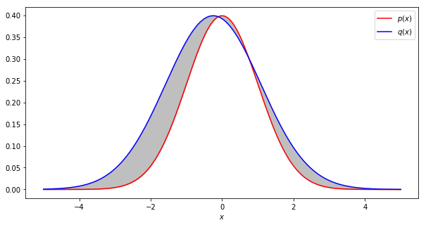

###########
Supervisor User Guide
###########

**********
Motivation
**********

My Model is Done!
=================

OK, so your model is trained and ready to be put into a production pipeline.
Models are, however, not like hard coded rules in the sense that they are not
expected to work perfectly all the time. They are expected to work well most of
the time. And just because a model was tested on a sample of data does not mean
it will continue to be accurate forever.

Think of it this way, you want to predict human weight from height. You build a
linear model from some demographics from a small US city that multiplies height
by some number and adds another number, and is on average pretty accurate for
predicting weight. Great! Now you put it into production, and it works fine. A
few years later, a series of fast food chains opens up, and everyone in the
town starts gaining weight. Your model becomes less accurate because the data
you built it on is no longer a valid representation of the current population.
This is why you need a monitoring system. It costs almost nothing to put one in
place, and it's the only way you'll know if your model is still accurate over
time.

How?
====

There are `tons
<https://scikit-learn.org/stable/modules/model_evaluation.html>`_ of ways to
evaluate model performance, but they all require you to know what you wanted
the model to say in hindsight. These metrics are typically used to assess
accuracy during training and validation. Going back to our example, we could
tell exactly the degree to which our linear weight from height model was
degrading each year by measuring everyone's weight and height each year. That's
fine if you don't mind waiting to take measurements. In real life, there are
lots of situations for which we get pretty fast feedback, and for those
situations, it's fine just to validate the model on new incoming data in the
same manner that it was validated during training. However, there are also
plenty of situations where this is not the case...  

Divergence What?
================ 

Just as we can compare the data coming out of a model to ground truth, we can
compare the data coming into the model to the training data. In the former
case, we match up each prediction to the answer we wished in hindsight we had
gotten, and summarize the results with any number of accuracy metrics. We can
generally compare the inputs to the input data used to train the model. In this
sense, we can ask questions like "Does this batch of inputs seem distributed
like the training data?" and "Does this particular input look strange relative
to what was used in the training data?" In the former case, your inputs
generally arrive in batches. Maybe once a month you collect height data and run
your model to compute weights. You can then ask does this month's height
distribution look similar to the height distribution of the training data? It may
seem hard to quantify, and that's because it is! Though it's not impossible.
There are a number of so called `statistical divergences
<https://en.wikipedia.org/wiki/Divergence_(statistics)>`_. They give a number
that represents how similar two distributions are. For example, two identical
Gaussians might get a score of 0, and a Gaussian paired with a uniform
distribution might get a score of 0.4. Generally, a divergence will give its
lowest possible score when the two distributions are the one and the same, and
its highest possible value when they predict mutually exclusive outcomes (e.g.
distribution one says a coin will always come up tails and distribution two
says a coin will always come up heads). We can recommend and have implemented a
few metrics in the :doc:`Supervisor <supervisor.divergence>` that have some
other useful properties like symmetry (the number compare distribution one to
distribution two is the same number computed from comparing distribution two to
distribution one) and the triangle inequality  (divergence of distribution one
and two plus divergence of distribution two and three is less than or equal to
divergence of distribution one and three). In math jargon, these extra
properties make these divergences metrics which in turn means they have the same
consistencies you would intuitively associate with a measure of distance. This
makes plots much more meaningful because your intuition about distances holds
when you look at a plot involving divergence metrics.

***********
Divergences
***********

.. currentmodule:: mvtk.supervisor.divergence

Divergences are all about quantifying differences between two probability
distributions. This is not just about a literal subtraction of one value from
another, so much as coming up with a process that assigns a number that
quantifies how different two (or more) probability distributions are. For
example, the number might decrease as the two distributions approach being one
and the same. Generally, the number will approach its maximum (which can be
infinity!) when there exist no events that can be sampled from both
distributions. For example, a coin that would always come up heads in the first
distribution would always come up tails in the second distribution. In other
words, they are `singular <https://en.wikipedia.org/wiki/Singular_measure>`_.

A common and useful metric is called `total variation
<https://en.wikipedia.org/wiki/Total_variation_distance_of_probability_measures>`_.
Total variation is defined as one half the average absolute difference between
the two probability distributions being compared, :math:`p` and :math:`q`
:cite:`yale598`.

.. math::
    \frac{1}{2}\int dx \vert p(x) - q(x)\vert

    Total variation is one half the average absolute difference between two
    probability distributions (shown in grey).

By factoring out :math:`q(x)` and applying the `law of large numbers
<https://en.wikipedia.org/wiki/Law_of_large_numbers>`_, this can be rewritten
as

.. math::
    \mathbb{E}_{x \sim q}\frac{1}{2}\left\vert 1 - \frac{p(x)}{q(x)}\right\vert

This is one example of what are generally known as an :math:`f` (sometimes
:math:`\phi`) divergence. In the case of total divergence,
:math:`f\left(\frac{q}{p}\right) = \frac{1}{2}\left\vert 1 - \frac{q}{p}\right\vert`. In
general, :math:`f` can be any `convex function
<https://en.wikipedia.org/wiki/Convex_function>`_ of :math:`\frac{p}{q}` with
its minimum at :math:`p=q` (typically such that :math:`f(1)=0`). This class of
measures will produce a statistic that decreases as :math:`p` approaches
:math:`q` :cite:`csiszar2004information` :cite:`yale598`. It is easy to see by
the `change of variables formula for probability density functions
<https://en.wikipedia.org/wiki/Probability_density_function#Function_of_random_variables_and_change_of_variables_in_the_probability_density_function>`_
that this class of divergences encompasses every divergence that is invariant
to coordinate transformations. There are many other commonly cited
:math:`f`-divergences, including `Hellinger distance
<https://en.wikipedia.org/wiki/Hellinger_distance>`_, `Kullback–Leibler (KL)
divergence
<https://en.wikipedia.org/wiki/Kullback%E2%80%93Leibler_divergence>`_, and
`Jensen-Shannon divergence
<https://en.wikipedia.org/wiki/Jensen%E2%80%93Shannon_divergence>`_
:cite:`nowozin2016f`. Jensen-Shannon divergence admits a natural generalization
that measures the mutual distance of multiple probability distributions, and
all of the divergences measured thus far are bounded between :math:`0` and
:math:`1`.  

In general, not all :math:`f` divergences are proper `metrics
<https://en.wikipedia.org/wiki/Metric_(mathematics)>`_. As a motivating
example, consider KL-divergence:

.. math::
    \mathbb{E}_{x\sim q}-\log\left(\frac{p(x)}{q(x)}\right)

Clearly, this divergence is not even symmetric with respect to :math:`p`
and :math:`q`. As it turns out, it does not obey the triangle inequality
either. This is not always bad. The KL-divergence is a useful measure, and will
increase as :math:`p` and :math:`q` become less similar. However, it lacks any
intuitive sense of distance as plotted over time. For this reason, most
analyses of concept drift prefer divergences that are proper metrics
:cite:`webb2016characterizing`.

As we shall see, there are two ways to estimate :math:`f`-divergences: with
density estimators, and with variational methods.

Estimation with Density Estimators
==================================

The most intuitive approach to estimating `f`-divergences is with density
estimation. This involves estimating :math:`p(x)` and :math:`q(x)` given a
finite number of samples, and then plugging those estimates into the explicit
formula for your `f`-divergence.

.. math::
    \sum\limits_{x\in\mathcal{X}}f\left(\frac{p(x)}{q(x)}\right)q(x)

Here, :math:`\mathcal{X}` is the shared `sample space
<https://en.wikipedia.org/wiki/Sample_space>`_ of :math:`p` and :math:`q`. The
simplest form of density estimator is a `histogram
<https://en.wikipedia.org/wiki/Histogram>`_, and the Supervisor not only
provides common utilities for density estimator based estimates of
:math:`f`-divergences, but also can also construct histograms from raw data.

The following functions come with the Supervisor's :doc:`divergence
<supervisor.divergence>` module for estimating :math:`f`-divergences by
explicitly constructing histograms from raw samples.

.. topic:: Estimates via maximum likelihood density estimators

    * :meth:`calc_hl_mle` for Hellinger distance
    * :meth:`calc_js_mle` for Jensen Shannon divergence
    * :meth:`calc_kl_mle` for KL-divergence
    * :meth:`calc_tv_mle` for Total variation

Alternatively, if you chose to construct your own density estimates, you can
use the following functions to calculate :math:`f`-divergences from those.

.. topic:: Estimates via externally computed density estimates

    * :meth:`calc_hl_density` for Hellinger distance
    * :meth:`calc_js_density` for Jensen Shannon divergence
    * :meth:`calc_kl_density` for KL-divergence
    * :meth:`calc_tv_density` for Total variation

Variational Estimation of :math:`f`-divergences
===============================================

Density estimation via histograms is straightforward, and indeed a gold
standard of sorts, for categorical data. However, constructing histograms for
real valued data requires binning, which tends to become increasingly
inaccurate for high dimensional samples. Variational estimation, while only
directly applicable to real valued data, is generally believed to scale better
with the number of features :cite:`sriperumbudur2009integral` :cite:`nguyen2010estimating`.

What are variational estimates? In general, `variational methods
<https://en.wikipedia.org/wiki/Calculus_of_variations>`_ refer to a problem
involving finding a *function* that satisfies some optimization problem. In
other words, if an ordinary `optimization problem
<https://en.wikipedia.org/wiki/Optimization_problem>`_ involves finding an
optimal location in a finite dimensional coordinate system, variational
problems involve finding optimal location in *function space*, which involves
an `uncountably infinite
<https://en.wikipedia.org/wiki/Cantor%27s_diagonal_argument>`_ `number of
coordinates <https://en.wikipedia.org/wiki/Hilbert_space>`_.  

There are some clever tricks from convex analysis :cite:`yale598` that can
apply to :math:`f`-divergences. We first define the `convex conjugate
<https://en.wikipedia.org/wiki/Convex_conjugate>`_ as

.. math::
    f^{*}(y) = \sup\limits_g\left[gy - f(g)\right]

The `Fenchel–Moreau theorem
<https://en.wikipedia.org/wiki/Fenchel%E2%80%93Moreau_theorem>`_ states that if
:math:`f` is a `proper convex function
<https://en.wikipedia.org/wiki/Proper_convex_function>`_ and `lower
semicontinuous <https://en.wikipedia.org/wiki/Semi-continuity>`_, then
:math:`f^{**}(g) = f(g)`.

This is true for a wide variety of useful functions :math:`f`
:cite:`nowozin2016f`. Under these conditions, we have

.. math::
    f(y) = \sup\limits_g\left[gy - f^{*}(g)\right]

If we let :math:`y=\frac{p(x)}{q(x)}` for some point, :math:`x`, within the
sample space of :math:`p` (which is assumed to be the same as that of
:math:`q`),

.. math::
    f\left(\frac{p(x)}{q(x)}\right) = \sup\limits_g\left[g\frac{p(x)}{q(x)} -
    f^{*}(g)\right] \ge g\frac{p(x)}{q(x)} - f^{*}(g)

, where the inequality follows from the definition of the `supremum
<https://en.wikipedia.org/wiki/Infimum_and_supremum>`_. Furthermore, if we
tether :math:`g` to that same sample, :math:`x`, in the form of :math:`g(x)`, we
get

.. math::
    f\left(\frac{p(x)}{q(x)}\right) \ge g(x)\frac{p(x)}{q(x)} - f^{*}(g(x))

Multiplying both sides by :math:`q(x)`

.. math::
    f\left(\frac{p(x)}{q(x)}\right)q(x) \ge g(x)p(x) - f^{*}(g(x))q(x)

Integrating both sides over :math:`x` drawn from the sample space, :math:`\mathcal{X}`,

.. math::
    \int\limits_{x\in\mathcal{X}} dx f\left(\frac{p(x)}{q(x)}\right)q(x) \ge
    \int\limits_{x\in\mathcal{X}} dx g(x)p(x) - f^{*}(g(x))q(x)

Finally, we can apply the `law of large numbers
<https://en.wikipedia.org/wiki/Law_of_large_numbers>`_ to turn integrals over
probability density functions into expectations.

.. math::
    \mathbb{E}_{x \sim q} f\left(\frac{p(x)}{q(x)}\right) \ge \mathbb{E}_{x
    \sim p} g(x) - \mathbb{E}_{x \sim q} f^{*}(g(x))

This final result shows that an :math:`f`-divergence can be expressed as a
function optimization problem. In this case, the right hand side of the
inequality prescribes a `loss function
<https://en.wikipedia.org/wiki/Loss_function>`_ with which we use to find a
function :math:`g(x)`. Specifically, the loss function used would be the
negative of the right hand side. When the loss is minimized, the right hand
side is maximized and the inequality approaches equality to the left hand side
(i.e. the true :math:`f`-divergence).

In practice, we can use a function approximator, such as a neural network to
find :math:`g(x)`. This in fact yields an unbiased estimator of the gradient when
trained via `stochastic gradient descent
<https://en.wikipedia.org/wiki/Stochastic_gradient_descent>`_
:cite:`nowozin2016f`.

.. note::
    It's also worth noting the significance of :math:`g(x)`. Rather than
    approximating :math:`p(x)` and :math:`q(x)` individually, the model trained to
    approximate :math:`g(x)` has learned the likelihood ratio,
    :math:`\frac{p(x)}{q(x)}` :cite:`nguyen2010estimating`.

    .. math::
        &f\left(\frac{p(x)}{q(x)}\right) =
        \sup\limits_{g(x)}\left[g(x)\frac{p(x)}{q(x)} - f^{*}(g(x))\right] \\
        &\partial_{g(x)}\left[g(x)\frac{p(x)}{q(x)} - f^{*}(g(x))\right] = 0 \\
        &f^{*\prime}(g(x)) = \frac{p(x)}{q(x)} \\
        &g(x) = f^{*\prime-1}\left(\frac{p(x)}{q(x)}\right)

    Where we are able to invert :math:`f^{*\prime}` when :math:`f^{*}` is
    strictly convex, and therefore has a strictly monotonic derivative when
    differentiable.

The following functions come with the Supervisor's :doc:`divergence
<supervisor.divergence>` module for estimating :math:`f`-divergences using
variational methods.

.. topic:: Estimates via variational estimators

    * :meth:`calc_hl` for Hellinger distance
    * :meth:`calc_js` for Jensen Shannon divergence
    * :meth:`calc_tv` for Total variation

Variational estimation is only applicable for numerically encoded data, and was
found to work poorly for `one hot encoded categorical data with large numbers
of categories <notebooks/Airlines>`_.

Hybrid Estimation
==================================

What if we have data that is partially categorical, and partially real valued?
Are we just limited to binning the real valued data to effectively make the
entire dataset categorical? As of the time of this writing, this seems to
have generally been the case. The Supervisor team has, however, implemented an
experimental hybrid approach just for you! Let's return to the variational formalism.

Let's say :math:`x` had some categorical components, :math:`x_c` and some real
valued components, :math:`x_r`. 

.. math::
    \mathbb{E}_{x_c, x_r \sim q} f\left(\frac{p(x_c, x_r)}{q(x_c, x_r)}\right)
    \ge \mathbb{E}_{x_c, x_r \sim p} g(x_c, x_r) - \mathbb{E}_{x_c, x_r \sim q}
    f^{*}(g(x_c, x_r))

To effectively use :math:`x_c` within our model for :math:`g(x_c, x_r)`, we may
store a table of functions :math:`g_{x_c}(x_r)` and simultaneously train them
as minibatches are sampled. In this way, every unique combination of
categorical variables, :math:`x_c`, specifies a model :math:`g_{x_c}` that is
trained using a respective :math:`x_r`. This requires storing and training as
many models as there are unique combinations of categorical inputs within the
given datasets. The performance of our hybrid approach will generally degrade
linearly with the number of unique combinations of categorical inputs.

In general, any variational method for computing divergences supports hybrid
estimation using two techniques. The ``categorical_columns`` argument can be
used to specify the indices of categorical features within the input data. This
will cause minibatches to be grouped by categorical features such that the
remaining numerical features of each group are fed to designated neural
network as described above. Alternatively, you can group each dataset by
categorical input before passing them to a variational estimator, and use the
``loss_kwargs={'weights': (p_c, q_c)}`` to reweigh the loss.

.. math::
    \mathbb{E}_{x \sim q} f\left(\frac{p(x)}{q(x)}\right) \ge \sum\limits_{x_c}
    p(x_c)\mathbb{E}_{x_r \sim p\left(x_r\vert x_c\right)} g_{x_c}(x_r) -
    q(x_c)\mathbb{E}_{x_r \sim q(x_r\vert x_c)} f^{*}(g_{x_c}(x_r))

In this version, you must externally iterate over unique combinations of
categorical features (that have been sampled) and supply a tuple of weights
:math:`p(x_c)`, :math:`q(x_c)` to ``loss_kwarg['weights']``. These respectively
represent an externally computed estimate of the probability of drawing a
specific combination of categorical variables from :math:`p` and :math:`q`.
These might be computed via histograms. See `estimation with density estimators
<user_guide.rst#estimation-with-density-estimators>`__ for resources within
this library for accomplishing this. This approch may be useful when computing
:math:`f`-divergences from within a distributed dataframe on a large cluster
with many unique combinations of categorical columns. You could compute a
histogram over the categorial portion of the data, parallelize separate
divergence-like computations over each unique combination of categorical values
in your dataset (as shown in the above equation), and sum the results. Note you
never have to consider unique combinations of categorical values that were not
in the original sample set, so you will never end up with more unique
combinations of categories than you have records accross both datasets.

Featureless Datasets
===============================================

Sometimes you're dealing with datasets that have varying lengths and are not
converted to a fixed number of features. For example, some NLP and time series
models do not provide obvious features. In this case, we can develop an lower
bound on total variation by training a model to distinguish the two datasets
with log loss. First start with the `Jensen-Shannon divergence
<https://en.wikipedia.org/wiki/Jensen%E2%80%93Shannon_divergence>`_ between the
two datasets.

.. math::
    \mathrm{JS}(P, Q) = \mathrm{KL}\left(p(y, X), p(y)p(X)\right)

Here, :math:`p` is the distribution of the combined labeled dataset (all
elements of :math:`P` with :math:`y=1` and all elements of :math:`Q` with
:math:`y=0`). Factoring :math:`P(X)` from :math:`P(y, X)`, we have
    
.. math::
    \mathrm{JS}(P, Q) = \mathbb{E}_{y, X\sim p}
    \ln\left(\frac{p(y|X)p(X)}{p(y)p(X)}\right) = \mathbb{E}_{y, X\sim p}
    \ln(p(y|X)) - \ln(p(y))

Hence the Jensen-Shannon divergence of the two datasets is just the entropy of
the target variable minus the binary cross entropy loss (log loss) of a model
trained to distinguish them. Assuming we balance the dataset or compensate
appropriately for class imbalance, the entropy term is just one bit. Since the
model's validation loss is an lower bound on the loss achievable by any model,
the resulting estimation of Jensen-Shannon divergence is a lower bound on the
true Jensen-Shannon divergence of the two datasets. Applying the following
inequality :cite:`lin1991divergence`

.. math::
    \mathrm{JS}(P, Q) \le \mathrm{TV}(P, Q) \ln(2)

results in a lower bound of total variation using this lower bound of
Jensen-Shannon divergence. :meth:`calc_tv_lower_bound` implements this lower
bound using binary cross entropy loss. However, it assumes a balanced dataset.
We have also implemented :meth:`balanced_binary_cross_entropy` to compute
binary cross entropy loss from predictions and labels while compensating for
class imbalance. The output can be fed directly to :meth:`calc_tv_lower_bound`.
Note a sufficiently poor model can produce log loss, and therefore lower bounds
of Jensen-Shannon divergence, lower than 0. This model can be replaced with a
trivial model that predicts :math:`p(y|X)=p(y)` for all :math:`X`, resulting in
a lower bound of :math:`0`.

Integral Probability Metrics
============================

There are another class of divergences known as integral probability metrics.
They too generally admit density estimator based and variational methods of
estimation. The basic idea is we determine whether two samples come from the
same distribution by comparing expectations of different statistics. For example, we could compare means. That is,

.. math::
    \|\mathbb{E}_{x \sim p}\left[x\right] - \mathbb{E}_{x \sim q}\left[x\right]\|

This is clearly insufficient to properly identify different distributions. For
example, what if :math:`p` and :math:`q` have the same mean, but different
variances? We could just modify the test to include variance...

.. math::
    \left\vert\mathbb{E}_{x \sim p}\left[\operatorname{Var}(x)\right] - \mathbb{E}_{x \sim q}\left[\operatorname{Var}(x)\right]\right\vert

We can keep repeating this process of coming up with new operators, and taking
the absolute value of differences of its expectations over our two
distributions.

.. math::
    \left\vert\mathbb{E}_{x \sim p}\left[f(x)\right] - \mathbb{E}_{x \sim q}\left[f(x)\right]\right\vert

In some circles, :math:`f` is known as a *witness function*. Clearly, no one
choice of :math:`f` is sufficient, but if we try to find a function :math:`f`
that maximizes the absolute difference in expectations over :math:`p` and
:math:`q`, we can in fact build a statistic that is :math:`0` if and only if
:math:`p=q`. The space of `bounded
<https://en.wikipedia.org/wiki/Bounded_function>`_ `continuous
<https://en.wikipedia.org/wiki/Continuous_function>`_ functions are often cited
as sufficiently large, but several common integral probability metrics make use
of smaller subsets of this space :cite:`sriperumbudur2009integral`
:cite:`gretton2012kernel`.

We define an integral probability metric as the maximum absolute difference in
expectations over a sufficiently large class of functions :math:`\mathcal{F}`
:cite:`sriperumbudur2009integral`.
 
.. math::
    \sup\limits_{f \in \mathcal{F}}\vert\mathbb{E}_{x \sim p}\left[f(x)\right] - \mathbb{E}_{x \sim q}\left[f(x)\right]\vert

Much like variational estimates of :math:`f`-divergences, we can approximate
integral probability metrics with neural network trained on the above
expression as a loss function. Depending on the nature of :math:`\mathcal{F}`,
this network may need to be regularized such that it is capable of producing
functions within :math:`\mathcal{F}` and nothing more. For example, when
:math:`\mathcal{F}=\{f : \|f\|_\infty \le 1\}`, the resulting metric is total
variation. However, :math:`f`-divergences and integral probability metrics are
generally considered distinct :cite:`sriperumbudur2009integral`.

.. note::
    Unlike for :math:`f`-divergence losses, `Jensen's inequality
    <https://en.wikipedia.org/wiki/Jensen%27s_inequality>`_ dictates finite
    sample estimates of integral probability metric losses and their gradients
    will have an upwards bias. This means large batch sizes should be helpful
    when training neural networks to estimate integral probability metrics.
    Several sources remedy this problem by constructing an unbiased estimate of
    the square of the integral probability metric. This generally sacrifices
    the `triangle inequality
    <https://en.wikipedia.org/wiki/Triangle_inequality>`_ for an unbiased
    estimate of the metric and its gradient :cite:`bellemare2017cramer`
    :cite:`gretton2012kernel`.  
    :cite:`bellemare2017cramer` furthur argues that this could cause
    convergence to an incorrect (over) estimate of true value of the metric.

Earth Mover's distance
----------------------

When we let :math:`\mathcal{F}` be the set of functions such that :math:`\|
f(x)-f(x^\prime)\|_p \le \| x - x^\prime\|_p`, where
:math:`\|\|_p` is the `Lp distance
<https://en.wikipedia.org/wiki/Taxicab_geometry>`_, we get the so called `earth
mover's distance <https://en.wikipedia.org/wiki/Earth_mover%27s_distance>`_ or
`Wasserstein metric <https://en.wikipedia.org/wiki/Wasserstein_metric>`_. See
:cite:`vherrmann` for an introduction to the mathematics behind this.

The earth mover's distance is implemented as :meth:`calc_em` within the
Supervisor's :doc:`divergence <supervisor.divergence>` module. While at least
two techniques currently exist to approximate earth mover's distance via
regularizing loss functions :cite:`arjovsky2017wasserstein`
:cite:`gulrajani2017improved`, we used a different implementation.

Since neural networks of finite depth will always output a function
differentiable almost everywhere, the `mean value theorem
<https://en.wikipedia.org/wiki/Mean_value_theorem>`_ dictates bounding the
derivative of a neural network where it exists is sufficient to bound its
`modulus of continuity <https://en.wikipedia.org/wiki/Modulus_of_continuity>`_.
In the case of the earth mover's distance,  the modulus of continuity is
bounded at :math:`1` given an :math:`L^p` metric space. By the chain rule, the
jacobian of the output of a neural network with `Relu
<https://en.wikipedia.org/wiki/Rectifier_(neural_networks)>`_ activations is
bounded above by the product of the jacobians of each layer. Therefore, if we
can bound the :math:`L^p \rightarrow L^p` `operator norm
<https://en.wikipedia.org/wiki/Operator_norm>`_ of each layer at :math:`1`, we
can bound the jacobian, and therefore the modulus of continuity of the entire
network, at :math:`1`.

This library implements the version for :math:`p=1`. :cite:`tropp2004topics`
states the operator norm of an operator from an :math:`L^1` metric space to
another :math:`L^1` metric space is bounded above by the :math:`L^1` norm of
its columns.  Therefore, simply normalizing the columns of each layer's weight
matrix by its :math:`L^1` norm before applying it is sufficient to restrict the
class of functions the neural network will be able to produce to those with a
modulus of continuity of :math:`1`. The Supervisor has a
:meth:`NormalizedLinear` layer for exactly this, and this is how the earth
mover's distance is implemented.  

:math:`f`-divergences vs Integral Probability Metrics
=====================================================

There have been several sources using earth mover's distance
:cite:`arjovsky2017wasserstein` :cite:`gulrajani2017improved` as a
differentiable hypothesis test to train `GANs
<https://en.wikipedia.org/wiki/Generative_adversarial_network>`_ as well as
other integral probability metrics :cite:`gretton2012kernel`
:cite:`bellemare2017cramer` (and :math:`f`-divergences too for that matter
:cite:`nowozin2016f`) with promising results. This is because
:math:`f`-divergences attain their maximum value when :math:`p` and :math:`q`
are `singular <https://en.wikipedia.org/wiki/Singular_measure>`_, while
integral probability metrics can assign a meaningful range of values. For
example, :cite:`arjovsky2017wasserstein` shows that when
:math:`p(x)=\delta(x)`, (where :math:`\delta` is the `Dirac delta function
<https://en.wikipedia.org/wiki/Dirac_delta_function>`_) and
:math:`q_a(x)=\delta(x-a)`, :math:`f`-divergences will attain their maximum
value when :math:`a \ne 0` and their minimum value when :math:`a = 0`.
Meanwhile the earth mover's distance will assign a value of :math:`a`, which
decreases smoothly to :math:`0` as :math:`p \rightarrow q`.

This can be useful in some circumstances because :math:`f`-divergences fail to
specify how different :math:`p` and :math:`q` are when :math:`p` and :math:`q`
are `singular <https://en.wikipedia.org/wiki/Singular_measure>`_. This can be
misleading when :math:`p` and :math:`q` have at least  one categorical
component that is generally different when sampled from each distribution, and
the resulting :math:`f`-divergence is forced to or near its maximum despite the
other features having otherwise similar distributions.

However, anything that is not an :math:`f`-divergence is necessarily a
coordinate dependent measure by the `change of variables formula for
probability density functions
<https://en.wikipedia.org/wiki/Probability_density_function#Function_of_random_variables_and_change_of_variables_in_the_probability_density_function>`_.
This too can give misleading results when different features have very
different senses of scale. We recommend at least normalizing features to the
same scale before using integral probability metrics.

.. topic:: Tutorials:

    * :doc:`Airlines <notebooks/divergence/Airlines>`
    * :doc:`Divergence Functions <notebooks/divergence/DivergenceFunctions>`
    * :doc:`Categorical Columns <notebooks/divergence/CategoricalColumns>`

.. bibliography:: refs.bib
    :cited:
