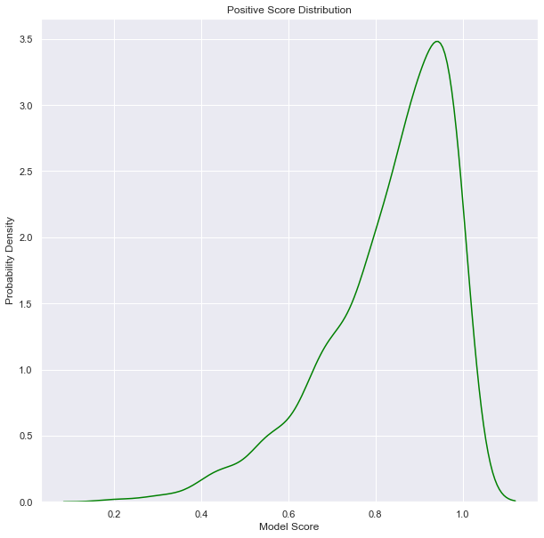
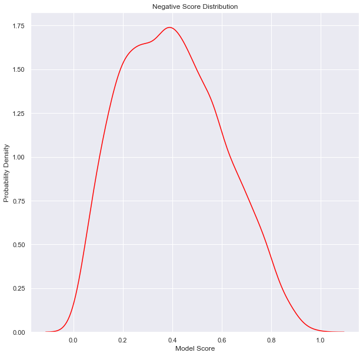
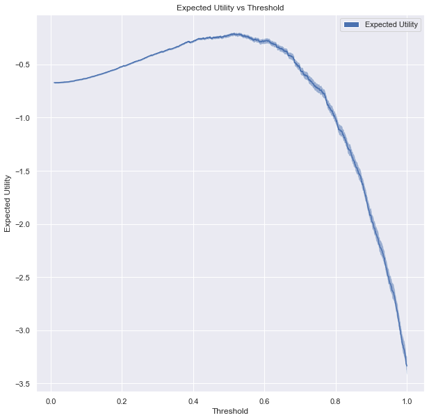
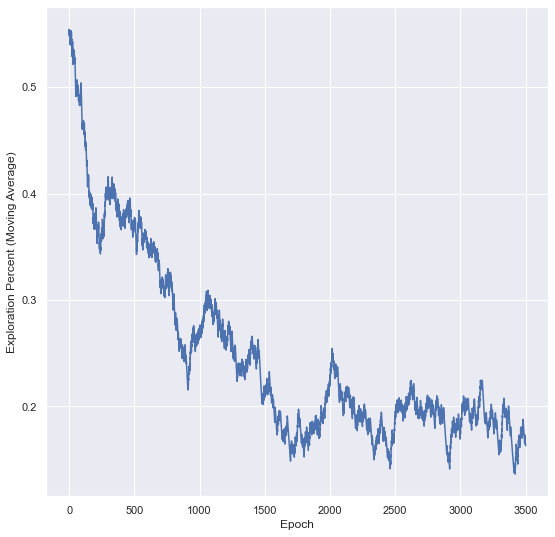

###########
Thresholding User Guide
###########

**********
Motivation
**********

Let's say you're monitoring some process for alerts. Maybe it's model
performance. Maybe it's model drift. In any case, let's say you have a score
that increases with the likelihood that you have something wrong that needs to be
investigated. You still need to decide whether to actually launch an
investigation or not for each of these scores. This is known as thresholding.
But where to put the threshold? Set it too high and you'll miss important
alerts. Set it too low and you'll be flooded with noise. This module comes with
tools and techniques to experimentally determine where to set your threshold
given your tolerance for noise.

How?
====

Let's say the scores associated with good alerts looks like this.

Moreover, scores associated with negative alerts look like this.

Clearly the likelihood of finding a good alert increases with model score, but
any choice will imply a trade off between true/false positive/negatives. In
general, you need to decide on a utility function of true/false
positive/negatives.

.. code-block:: python
    def utility(tp, fp, tn, fn):
        return tp - 20 * fn - fp

The utility function would increase with true positives and/or true negatives,
and decrease with false positives and/or false negatives. A risk averse utility
function is shown above with a 20 fold preference of avoiding false negatives
to false positives. In general, we will assume the utility function is a
*proportion* of true/false positive/negatives in a data set. In this sense, the
utility function is a function of a categorical distribution over true/false
positives/negatives.

Now that we have a utility function, and a sample of positive and negative alert
scores, we can plot a utility function as a function of threshold.

    Expected utility as a function of threshold (solid) and 50%
    `credible interval
    <https://en.wikipedia.org/wiki/Credible_interval>`_ (shaded
    region).

Note that we don't actually have the true distribution of positive
and negative scores in practice. Rather, we have examples. If we
only had 4 positive scores and 4 negative scores, we cannot be very
certain of its results. More on this in the `credibility user guide
<credibility_user_guide.rst>`__. We model the distribution of true/false
positive/negatives as a `Dirichlet-multinomial distribution
<https://en.wikipedia.org/wiki/Dirichlet-multinomial_distribution>`_ with
a `maximum entropy prior
<https://en.wikipedia.org/wiki/Principle_of_maximum_entropy>`_.

This shows a particularly apparent peak in utility, but only after (in this
case) a few thousand example scores. In practice, we could well be starting
with *no* examples and building up our knowledge as we go. To make things
worse, we will only find out if an alert was good or not if we investigate it.
Anything that falls below our threshold forever remains unlabeled. We developed
a specific algorithm to tackle this problem that we call *adaptive
thresholding*.

***********
Adaptive Thresholding
***********

We face a classic `exploitation/exploration dilemma
<https://en.wikipedia.org/wiki/Reinforcement_learning>`_. We can either choose
to *exploit* the information we have so far about positive and negative score
distributions to set a threshold or *explore* what may lie below that threshold
by labeling whatever comes in next. Unfortunately, the labels obtained from
scores greater than a threshold chosen at the time pose a challenge in that
they yield heavily biased estimates of positive and negative score
distributions (since they don't include anything below the threshold set at the
time). We have not found a good way to compensate for that bias in practice.
Rather, we must switch between an optimally set threshold and labeling
whatever comes next. This produces a series of *unbiased labels*.

Our adaptive thresholding algorithm seeks to balance the
opportunity cost of labeling data with the utility gained over subsequent
rounds with the change in threshold. Each score with an unbiased label is a
potential threshold. For each of those options, we sample a possible
distribution of true/false positives/negatives (with a Dirichlet-multinomial
distribution with a maximum entropy prior) using the other unbiased labels.
Utilities are calculated for each sampled distribution for true/false
positives/negatives. The highest utility is noted as well as the utility of
setting the threshold to 0 (exploration). Next this process is repeated using
all but the most recent unbiased label. We locate the optimal threshold
computed using all but the most recent unbiased label, and then compute the
utility of that threshold using the utilities calculated using *all* unbiased
labels. The difference between this utility and the utility of the true optimal
threshold is the expected utility gained from the last round of exploration.
This expected utility gained per round times the number of rounds since the
last round of exploration is the net utility gained since the last round of
experimentation. Meanwhile the difference between the utility of the true
optimal threshold and the utility of exploration is the opportunity cost of
exploration. When the net utility gained exceeds the opportunity cost of
exploration, exploration is chosen over exploitation.

Note that we stochastically sample utilities at the score associated with each
unbiased label at each round. This is necessary to prevent deadlocks in which
the optimal threshold is identical before and after experimentation, leaving
the expected utility gained per round 0 forever (thus ending any possibility of
subsequent rounds of exploration). Rather, exploration is chosen according to
the *probability* that net utility gained has in fact caught up with the
opportunity cost of the last round of exploration.

However, as we gain a more accurate picture of the distribution of positive and
negative scores, we make smaller changes to our best guess at the location of
the optimal threshold after exploration. As a result, the expected utility
gained per round of exploitation will gradually decrease over time, and we will
need more and more rounds of exploitation to make up for the opportunity cost
of exploration (shown below).

    Probability of chosing exploration decreases from about 45% at the
    beginning to about 5% after 3600 rounds.

.. topic:: Tutorials:

    * :doc:`Thresholding <notebooks/thresholding/Thresholding>`

.. bibliography:: refs.bib
    :cited:
